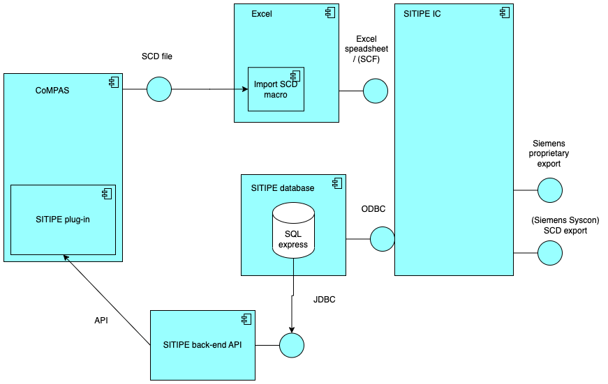

<!--
SPDX-FileCopyrightText: 2023 Alliander N.V.

SPDX-License-Identifier: Apache-2.0
-->

[](https://github.com/com-pas/compas-sitipe-service/actions?query=workflow%3A"Build+Project")
[](https://api.reuse.software/info/github.com/com-pas/compas-sitipe-service)
[](https://sonarcloud.io/dashboard?id=com-pas_compas-sitipe-service)
[](https://bestpractices.coreinfrastructure.org/projects/5925)
[](http://lfenergy.slack.com/)

# CoMPAS Sitipe-service
Siemens SITIPE for CoMPAS

This repository contains an CoMPAS extension in order to integrate with Siemens SITIPE.  
It is open source software to interact with Siemens SITIPE.

Siemens SITIPE allows users to import an SCD file in order to work as much vendor independent as possible. 
In order to make that work, the SCD file should contain the required Siemens SITPE extensions. 
In order to get these 61850 private extensions. 
The SITIPE database is used to have a single source of true for all templates used (IEC61850 and Siemens specific settings).

The architecture looks like this:


The output of CoMPAS (the SCD file) can be loaded into the SITIPE using the Excel SCD import macro inside de SCF file. Please note that their could be SCD import restrictions for SITIPE. This is outside the control of the CoMPAS project.


The contract framework and versions are currently a deployment setting. The SITIPE back-end consist of 3 seperate components.

#### Sitipe-Service-app

Interaction with the front-end application.
The front-end app can choose between XML or Json output.


#### Sitipe-Service-Service

Business logic to convert the API calls to SQL logic.


#### Sitipe-Service repository

Making the connection to the SITIPE database.


Example XML output of the Sitipe-Service app

```xml
<?xml version="1.0" encoding="UTF-8" standalone="yes"?>
<ns3:BayTypicalResponse xmlns:compas-commons="https://www.lfenergy.org/compas/commons/v1"
    xmlns:ns3="https://www.lfenergy.org/compas/SitipeService/v1">
    <ns3:BayTypical>
        <ns3:Id>1</ns3:Id>
        <ns3:AccessId>3BD3CA17-8136-4F72-A381-9C047FF1F3A8</ns3:AccessId>
        <ns3:Name>E01</ns3:Name>
        <ns3:Version>1</ns3:Version>
        <ns3:Description></ns3:Description>
        <ns3:Released>1</ns3:Released>
        <ns3:LockedBy></ns3:LockedBy>
        <ns3:LockedOn>0</ns3:LockedOn>
        <ns3:ModifiedOn>0</ns3:ModifiedOn>
        <ns3:SmrFile>SMR_4_BT_PAS-SS_IID_DM - enhanced Vienna.smr</ns3:SmrFile>
        <ns3:ContentVersion>4.0</ns3:ContentVersion>
        <ns3:ReferenceAccessId>00000000-0000-0000-0000-000000000000</ns3:ReferenceAccessId>
    </ns3:BayTypical>
    <ns3:BayTypical>
        <ns3:Id>2</ns3:Id>
        <ns3:AccessId>3A80B5B7-B42E-41DD-BD4C-CD4AE454017C</ns3:AccessId>
        <ns3:Name>E02</ns3:Name>
        <ns3:Version>1</ns3:Version>
        <ns3:Description></ns3:Description>
        <ns3:Released>1</ns3:Released>
        <ns3:LockedBy></ns3:LockedBy>
        <ns3:LockedOn>0</ns3:LockedOn>
        <ns3:ModifiedOn>0</ns3:ModifiedOn>
        <ns3:SmrFile>SMR_4_BT_PAS-SS_IID_DM - enhanced Vienna.smr</ns3:SmrFile>
        <ns3:ContentVersion>4.0</ns3:ContentVersion>
        <ns3:ReferenceAccessId>00000000-0000-0000-0000-000000000000</ns3:ReferenceAccessId>
    </ns3:BayTypical>
</ns3:BayTypicalResponse>
```

Example Json output:

```json
[
    {
        "id": 1,
        "accessId": "3BD3CA17-8136-4F72-A381-9C047FF1F3A8",
        "name": "E01",
        "version": "1",
        "description": "",
        "released": 1,
        "lockedBy": "",
        "lockedOn": 0,
        "modifiedOn": 0,
        "smrFile": "SMR_4_BT_PAS-SS_IID_DM - enhanced Vienna.smr",
        "contentVersion": "4.0",
        "referenceAccessId": "00000000-0000-0000-0000-000000000000"
    },
    {
        "id": 2,
        "accessId": "3A80B5B7-B42E-41DD-BD4C-CD4AE454017C",
        "name": "E02",
        "version": "1",
        "description": "",
        "released": 1,
        "lockedBy": "",
        "lockedOn": 0,
        "modifiedOn": 0,
        "smrFile": "SMR_4_BT_PAS-SS_IID_DM - enhanced Vienna.smr",
        "contentVersion": "4.0",
        "referenceAccessId": "00000000-0000-0000-0000-000000000000"
    }
]
```

Please note; This is not an official Siemens (supported) project. 
Check the license to see what is possible with the code. 
Siemens is registered trademark.
The database contains example data from Siemens.

## Development

Information about how to run and develop for this project check  [Development](./DEVELOPMENT.md).

## Environment Variables

|Environment Variable  | Default  | Example |
|--|--|--|
| JWT_VERIFY_KEY  | http://localhost:8089/auth/realms/compas/protocol/openid-connect/certs | http://localhost:8089/auth/realms/compas/protocol/openid-connect/certs |
| JWT_VERIFY_ISSUER | http://localhost/auth/realms/compas | http://localhost/auth/realms/compas |
| JWT_VERIFY_CLIENT | sitipe-service | sitipe-service |
| JWT_GROUPS_PATH | resource_access/sitipe-service/roles | resource_access/sitipe-service/roles |
| SITIPE_FRAMEWORK_ID | - | cf1 |
| SITIPE_VERSION | 1.00 | 1.00 |
| SITIPE_MSSQL_URL | _ | jdbc:sqlserver://localhost:1433;databaseName=DB_2019_IC1;ssl-mode=disabled;trustServerCertificate=true;encrypt=false;integratedSecurity=false;
| SITIPE_MSSQL_USER | sa | sa |
| SITIPE_MSSQL_PASSWORD | - | bigStrongPwd123! |

## Security

To use most of the endpoints the users needs to be authenticated using JWT in the authorization header. There are [4 environment variables](#environment-variables) that can be set in the container to configure the validation/processing of the JWT.

## Local Development
You can start the mssql database by running one of the following commands:

### Mac M1
```
docker-compose --env-file docker/.env -f docker/docker-compose-m1.yml up -d --build
```

### AMD64
```
docker-compose --env-file docker/.env -f docker/docker-compose-amd64.yml up -d --build
```

Quarkus can be started in dev mode:
```
./mvnw -DskipTests=true  package io.quarkus:quarkus-maven-plugin::dev
```